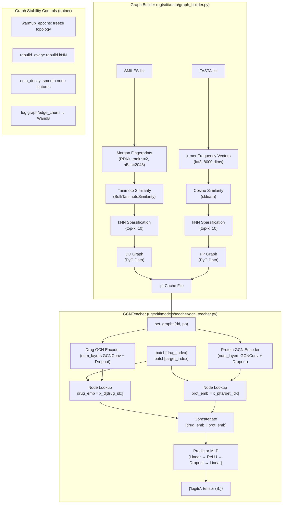

# Design Document: Teacher GNN (Phase 11 UGTSDTI)

## Overview

Phase 11 thay thế `baseline_teacher` (dummy `nn.Embedding`) bằng một Teacher GNN thực sự. Teacher GNN là một **transductive encoder** hoạt động trên hai đồ thị tương đồng toàn cục:

- **DD Graph** (Drug-Drug): nodes là drug molecules, edges dựa trên Tanimoto similarity của Morgan fingerprints (RDKit ECFP4).
- **PP Graph** (Protein-Protein): nodes là protein sequences, edges dựa trên cosine similarity của k-mer frequency vectors.

Tại inference, Teacher lookup node embeddings bằng `batch["drug_index"]` và `batch["target_index"]` (sequential node indices 0..N-1), sau đó dự đoán DTI từ cặp embedding đó.

**Mục tiêu chính:**
- Teacher confident (low MC-Dropout variance) ở S1 (warm-start) → PairGate α → 1 → Teacher dominates.
- Teacher uncertain (high MC-Dropout variance) ở S4 (cold-start, new nodes không có edges) → PairGate α → 0 → Student dominates.
- KD loss có ý nghĩa: Student học được graph structure signal từ Teacher.

---

## Architecture

### Tổng quan luồng dữ liệu



### Kiến trúc GCNTeacher

```
Input: batch["drug_index"] (B,), batch["target_index"] (B,)
         ↓                              ↓
DD Graph (n_drugs, 2048)         PP Graph (n_proteins, 8000)
         ↓                              ↓
GCNConv(2048 → hidden_dim)       GCNConv(8000 → hidden_dim)
ReLU + Dropout                   ReLU + Dropout
         ↓ (repeat num_layers)         ↓ (repeat num_layers)
Node Embeddings (n_drugs, H)     Node Embeddings (n_proteins, H)
         ↓                              ↓
Lookup drug_idx → (B, H)         Lookup target_idx → (B, H)
         ↓                              ↓
         └──────── Concat ─────────────┘
                      ↓
              (B, 2H) → Linear(2H, H) → ReLU → Dropout → Linear(H, 1)
                      ↓
              logits (B,)
```

---

## Components and Interfaces

### 1. `ugtsdti/data/graph_builder.py`

Module mới, không thuộc `core/` (không frozen).

```python
def build_drug_drug_graph(
    smiles_list: list[str],
    radius: int = 2,
    nbits: int = 2048,
    top_k: int = 10,
) -> torch_geometric.data.Data:
    """Returns Data(x=(n,2048), edge_index=(2,E), num_nodes=n)"""

def build_protein_protein_graph(
    fasta_list: list[str],
    k: int = 3,
    top_k: int = 10,
) -> torch_geometric.data.Data:
    """Returns Data(x=(n,8000), edge_index=(2,E), num_nodes=n)"""

def build_and_cache_graphs(
    smiles_list: list[str],
    fasta_list: list[str],
    cache_path: str = "data/cache/similarity_graphs.pt",
) -> dict[str, Data]:
    """Build or load from cache. Returns {"dd": dd_graph, "pp": pp_graph}"""

def load_graphs(cache_path: str) -> tuple[Data, Data]:
    """Load cached graphs. Returns (dd_graph, pp_graph)"""
```

**Index alignment constraint:** Node `i` trong DD Graph phải tương ứng với drug tại index `i` trong `smiles_list`. Tương tự cho PP Graph. Phải verify bằng assertion sau khi build.

### 2. `ugtsdti/models/teacher/gcn_teacher.py`

```python
@MODELS.register("gcn_teacher")
class GCNTeacher(nn.Module):
    def __init__(
        self,
        drug_feat_dim: int = 2048,
        protein_feat_dim: int = 8000,
        hidden_dim: int = 128,
        num_layers: int = 2,
        dropout: float = 0.3,
    ): ...

    def set_graphs(self, dd_graph: Data, pp_graph: Data) -> None:
        """Store global graphs. Must be called before forward()."""

    def forward(self, batch: dict) -> dict:
        """
        Args:
            batch: dict with keys "drug_index" (LongTensor B×1) and
                   "target_index" (LongTensor B×1)
        Returns:
            {"logits": FloatTensor (B,)}
        """
```

**Constraint:** Nếu `set_graphs()` chưa được gọi, `forward()` phải raise `RuntimeError` với message mô tả.

### 3. `configs/model/teacher/gcn.yaml`

```yaml
name: gcn_teacher
params:
  drug_feat_dim: 2048
  protein_feat_dim: 8000
  hidden_dim: 128
  num_layers: 2
  dropout: 0.3
```

### 4. `configs/trainer/default_trainer.yaml` — thêm `graph:` section

```yaml
graph:
  warmup_epochs: 5
  rebuild_every: 10
  ema_decay: 0.99
```

### 5. `ugtsdti/models/__init__.py` — thêm import

```python
from .teacher.gcn_teacher import GCNTeacher
```

### 6. Graph Stability Controller (trong Trainer hoặc callback)

Logic graph stability không thuộc `core/trainer.py` (frozen). Sẽ được implement như một utility function hoặc callback được gọi từ `main.py`:

```python
def maybe_rebuild_graph(
    teacher: GCNTeacher,
    epoch: int,
    warmup_epochs: int,
    rebuild_every: int,
    ema_decay: float,
    smiles_list: list[str],
    fasta_list: list[str],
) -> None:
    """Rebuild kNN graph if conditions are met, apply EMA, log edge churn."""
```

---

## Data Models

### DD Graph (`torch_geometric.data.Data`)

| Field | Type | Shape | Description |
|-------|------|-------|-------------|
| `x` | `FloatTensor` | `(n_drugs, 2048)` | Morgan fingerprint bit-vectors |
| `edge_index` | `LongTensor` | `(2, E)` | Undirected kNN edges |
| `num_nodes` | `int` | — | Số lượng drug nodes |

### PP Graph (`torch_geometric.data.Data`)

| Field | Type | Shape | Description |
|-------|------|-------|-------------|
| `x` | `FloatTensor` | `(n_proteins, 8000)` | k-mer frequency vectors (k=3, normalized) |
| `edge_index` | `LongTensor` | `(2, E)` | Undirected kNN edges |
| `num_nodes` | `int` | — | Số lượng protein nodes |

### Cache File (`.pt`)

```python
{
    "dd": Data(x=..., edge_index=..., num_nodes=...),
    "pp": Data(x=..., edge_index=..., num_nodes=...),
}
```

### Batch Dict (input to `GCNTeacher.forward`)

| Key | Type | Shape | Description |
|-----|------|-------|-------------|
| `drug_index` | `LongTensor` | `(B, 1)` | Sequential drug node index (0..n_unique_drugs-1) |
| `target_index` | `LongTensor` | `(B, 1)` | Sequential protein node index (0..n_unique_proteins-1) |

**Index Strategy:** `drug_index` trong batch là sequential node index (0..n_unique_drugs-1), tương ứng với vị trí drug trong danh sách unique drugs của split. Dùng trực tiếp để lookup node trong DD/PP graph mà không cần conversion.

**Ảnh hưởng đến `baseline_teacher`:** `nn.Embedding(num_drugs, hidden_dim)` dùng `num_drugs = dataset.num_unique_drugs` — set từ config hoặc runtime.

---

## Correctness Properties

*A property is a characteristic or behavior that should hold true across all valid executions of a system — essentially, a formal statement about what the system should do. Properties serve as the bridge between human-readable specifications and machine-verifiable correctness guarantees.*

### Property 1: Drug Fingerprint Extraction Invariant

*For any* list of SMILES strings, the output node feature matrix `x` must have shape `(len(smiles_list), 2048)`, and for each valid SMILES at index `i`, `x[i]` must be non-zero and equal to the Morgan fingerprint independently computed for `smiles_list[i]`.

**Validates: Requirements 1.1, 1.3, 1.4**

---

### Property 2: Protein k-mer Extraction Invariant

*For any* list of amino acid sequences, the output node feature matrix `x` must have shape `(len(fasta_list), 8000)`, and for each non-empty sequence, the L1 norm of `x[i]` must equal 1.0 (normalized). For sequences with no valid k-mers, `x[i]` must be the zero vector.

**Validates: Requirements 2.1, 2.2, 2.3, 2.4**

---

### Property 3: Graph Symmetry

*For any* graph (DD or PP) built by `Graph_Builder`, for every edge `(i, j)` present in `edge_index`, the reverse edge `(j, i)` must also be present in `edge_index`. No self-loops `(i, i)` should exist.

**Validates: Requirements 3.3, 4.3**

---

### Property 4: Graph Degree Bound

*For any* graph built by `Graph_Builder` with parameter `top_k`, the degree of every node must be at most `2 * top_k` (since edges are added in both directions). This ensures kNN sparsification is correctly applied.

**Validates: Requirements 3.2, 4.2**

---

### Property 5: Graph Cache Round-Trip

*For any* valid DD Graph or PP Graph built by `Graph_Builder`, saving to disk via `torch.save` then loading via `torch.load` must produce a graph with identical `x` (element-wise equal), identical `edge_index`, and identical `num_nodes`.

**Validates: Requirements 5.1, 5.2, 13.1, 13.2**

---

### Property 6: GCNTeacher Forward Shape

*For any* batch of size `B` with valid `drug_index` and `target_index` tensors (indices within graph bounds), calling `GCNTeacher.forward(batch)` must return a dict with key `"logits"` where `logits.shape == (B,)` and `logits.dtype == torch.float32`.

**Validates: Requirements 6.2, 6.3**

---

### Property 7: MC-Dropout Non-Zero Variance

*For any* batch and any `GCNTeacher` with `dropout >= 0.2`, running 20 forward passes in `model.train()` mode must produce `logits.var(dim=0) > 0` for all samples in the batch. This ensures MC-Dropout uncertainty estimation is functional.

**Validates: Requirements 6.4, 6.8, 9.2**

---

### Property 8: EMA Update Formula

*For any* node feature tensor `feat_old`, new feature tensor `feat_new`, and `ema_decay ∈ [0, 1]`, the EMA update must produce `result = ema_decay * feat_old + (1 - ema_decay) * feat_new` element-wise. When `ema_decay = 1.0`, `result` must equal `feat_old` exactly (no change).

**Validates: Requirements 11.1, 11.3**

---

### Property 9: Edge Churn Computation

*For any* two edge sets `old_edges` and `new_edges`, the computed edge churn must equal `len(symmetric_difference(old_edges, new_edges)) / max(len(old_edges), 1)`. This must hold for all valid edge set pairs including empty sets.

**Validates: Requirements 12.1**

---

## Error Handling

### Graph Builder

| Condition | Behavior |
|-----------|----------|
| Invalid SMILES (RDKit parse fails) | Assign zero vector `(2048,)`, continue processing |
| Empty SMILES list | Return `Data(x=zeros(0,2048), edge_index=zeros(2,0), num_nodes=0)` |
| No valid edges after kNN | Return `edge_index` of shape `(2, 0)`, không raise error |
| `num_nodes != len(input_list)` sau khi build | Raise `ValueError` với message mô tả |
| Cache directory không tồn tại | Tạo tự động với `os.makedirs(..., exist_ok=True)` |

### GCNTeacher

| Condition | Behavior |
|-----------|----------|
| `forward()` gọi trước `set_graphs()` | Raise `RuntimeError("Graphs not set. Call set_graphs(dd_graph, pp_graph) before forward.")` |
| `drug_index` out of bounds (>= n_drugs) | PyTorch sẽ raise `IndexError` tự nhiên từ tensor indexing |
| `dropout = 0.0` | MC-Dropout variance sẽ = 0; không raise error nhưng uncertainty estimation vô nghĩa |

### Graph Stability Controls

| Condition | Behavior |
|-----------|----------|
| `warmup_epochs = 0` | Rebuild ngay từ epoch đầu tiên |
| `rebuild_every = 0` | Không bao giờ rebuild (static graph) |
| `ema_decay = 1.0` | Node features không thay đổi (EMA disabled) |

---

## Testing Strategy

### Dual Testing Approach

Cả unit tests và property-based tests đều cần thiết và bổ sung cho nhau:
- **Unit tests**: Kiểm tra các ví dụ cụ thể, edge cases, error conditions, và integration points.
- **Property tests**: Kiểm tra các invariants phổ quát trên nhiều inputs ngẫu nhiên.

### Property-Based Testing Library

Sử dụng **`hypothesis`** (Python) — thư viện PBT phổ biến nhất cho Python, tích hợp tốt với pytest.

```bash
pip install hypothesis
```

Mỗi property test phải chạy tối thiểu **100 iterations** (Hypothesis default là 100, có thể tăng với `@settings(max_examples=200)`).

### Property Tests

Mỗi property test phải được tag với comment:
`# Feature: teacher-gnn, Property {N}: {property_text}`

**P1 — Drug Fingerprint Extraction Invariant**
```python
# Feature: teacher-gnn, Property 1: Drug fingerprint extraction invariant
@given(smiles_list=st.lists(st.sampled_from(VALID_SMILES_POOL), min_size=1, max_size=20))
def test_drug_fingerprint_shape_and_ordering(smiles_list):
    dd_graph = build_drug_drug_graph(smiles_list)
    assert dd_graph.x.shape == (len(smiles_list), 2048)
    assert dd_graph.x.dtype == torch.float32
    # Verify ordering: node i matches smiles_list[i]
    for i, smi in enumerate(smiles_list):
        mol = Chem.MolFromSmiles(smi)
        if mol:
            assert dd_graph.x[i].sum() > 0  # non-zero for valid SMILES
```

**P2 — Protein k-mer Extraction Invariant**
```python
# Feature: teacher-gnn, Property 2: Protein k-mer extraction invariant
@given(fasta_list=st.lists(st.text(alphabet="ACDEFGHIKLMNPQRSTVWY", min_size=3), min_size=1, max_size=10))
def test_protein_kmer_shape_and_normalization(fasta_list):
    pp_graph = build_protein_protein_graph(fasta_list)
    assert pp_graph.x.shape == (len(fasta_list), 8000)
    for i, seq in enumerate(fasta_list):
        l1 = pp_graph.x[i].sum().item()
        assert abs(l1 - 1.0) < 1e-5 or l1 == 0.0  # normalized or zero
```

**P3 — Graph Symmetry**
```python
# Feature: teacher-gnn, Property 3: Graph symmetry
@given(smiles_list=st.lists(st.sampled_from(VALID_SMILES_POOL), min_size=2, max_size=15))
def test_graph_symmetry(smiles_list):
    dd_graph = build_drug_drug_graph(smiles_list)
    edges = set(map(tuple, dd_graph.edge_index.t().tolist()))
    for i, j in edges:
        assert (j, i) in edges  # undirected
        assert i != j  # no self-loops
```

**P4 — Graph Degree Bound**
```python
# Feature: teacher-gnn, Property 4: Graph degree bound
@given(smiles_list=st.lists(st.sampled_from(VALID_SMILES_POOL), min_size=2, max_size=20),
       top_k=st.integers(min_value=1, max_value=10))
def test_graph_degree_bound(smiles_list, top_k):
    dd_graph = build_drug_drug_graph(smiles_list, top_k=top_k)
    if dd_graph.edge_index.shape[1] > 0:
        degrees = torch.zeros(len(smiles_list), dtype=torch.long)
        degrees.scatter_add_(0, dd_graph.edge_index[0], torch.ones(dd_graph.edge_index.shape[1], dtype=torch.long))
        assert degrees.max().item() <= 2 * top_k
```

**P5 — Graph Cache Round-Trip**
```python
# Feature: teacher-gnn, Property 5: Graph cache round-trip
@given(smiles_list=st.lists(st.sampled_from(VALID_SMILES_POOL), min_size=1, max_size=10),
       fasta_list=st.lists(st.text(alphabet="ACDEFGHIKLMNPQRSTVWY", min_size=3), min_size=1, max_size=5))
def test_graph_cache_roundtrip(smiles_list, fasta_list, tmp_path):
    cache_path = str(tmp_path / "graphs.pt")
    graphs = build_and_cache_graphs(smiles_list, fasta_list, cache_path=cache_path)
    loaded = torch.load(cache_path)
    assert torch.equal(graphs["dd"].x, loaded["dd"].x)
    assert torch.equal(graphs["dd"].edge_index, loaded["dd"].edge_index)
    assert torch.equal(graphs["pp"].x, loaded["pp"].x)
```

**P6 — GCNTeacher Forward Shape**
```python
# Feature: teacher-gnn, Property 6: GCNTeacher forward shape
@given(batch_size=st.integers(min_value=1, max_value=16),
       n_drugs=st.integers(min_value=2, max_value=10),
       n_proteins=st.integers(min_value=2, max_value=10))
def test_gcn_teacher_forward_shape(batch_size, n_drugs, n_proteins):
    model = GCNTeacher(drug_feat_dim=2048, protein_feat_dim=8000, hidden_dim=32)
    dd = Data(x=torch.randn(n_drugs, 2048), edge_index=torch.zeros(2,0,dtype=torch.long), num_nodes=n_drugs)
    pp = Data(x=torch.randn(n_proteins, 8000), edge_index=torch.zeros(2,0,dtype=torch.long), num_nodes=n_proteins)
    model.set_graphs(dd, pp)
    batch = {
        "drug_index": torch.randint(0, n_drugs, (batch_size, 1)),
        "target_index": torch.randint(0, n_proteins, (batch_size, 1)),
    }
    out = model(batch)
    assert out["logits"].shape == (batch_size,)
    assert out["logits"].dtype == torch.float32
```

**P7 — MC-Dropout Non-Zero Variance**
```python
# Feature: teacher-gnn, Property 7: MC-Dropout non-zero variance
@given(batch_size=st.integers(min_value=1, max_value=8),
       dropout=st.floats(min_value=0.2, max_value=0.5))
def test_mc_dropout_variance(batch_size, dropout):
    model = GCNTeacher(dropout=dropout, hidden_dim=32)
    dd, pp = _make_mock_graphs()
    model.set_graphs(dd, pp)
    model.train()
    batch = {"drug_index": torch.zeros(batch_size, 1, dtype=torch.long),
             "target_index": torch.zeros(batch_size, 1, dtype=torch.long)}
    logits = torch.stack([model(batch)["logits"] for _ in range(20)])
    assert (logits.var(dim=0) > 0).all()
```

**P8 — EMA Update Formula**
```python
# Feature: teacher-gnn, Property 8: EMA update formula
@given(feat_old=arrays(dtype=np.float32, shape=st.integers(1, 100)),
       feat_new=arrays(dtype=np.float32, shape=st.integers(1, 100)),
       ema_decay=st.floats(min_value=0.0, max_value=1.0))
def test_ema_update_formula(feat_old, feat_new, ema_decay):
    assume(feat_old.shape == feat_new.shape)
    result = ema_update(torch.from_numpy(feat_old), torch.from_numpy(feat_new), ema_decay)
    expected = ema_decay * feat_old + (1 - ema_decay) * feat_new
    np.testing.assert_allclose(result.numpy(), expected, rtol=1e-5)
```

**P9 — Edge Churn Computation**
```python
# Feature: teacher-gnn, Property 9: Edge churn computation
@given(old_edges=st.frozensets(st.tuples(st.integers(0,9), st.integers(0,9))),
       new_edges=st.frozensets(st.tuples(st.integers(0,9), st.integers(0,9))))
def test_edge_churn_formula(old_edges, new_edges):
    churn = compute_edge_churn(old_edges, new_edges)
    expected = len(old_edges.symmetric_difference(new_edges)) / max(len(old_edges), 1)
    assert abs(churn - expected) < 1e-6
```

### Unit Tests

Unit tests tập trung vào các ví dụ cụ thể, edge cases, và integration points:

```python
# tests/test_teacher_gnn.py

def test_gcn_teacher_registered():
    """Req 6.1, 8.1, 8.3: Registry integration"""
    from ugtsdti.models import GCNTeacher
    model = MODELS.build({"name": "gcn_teacher", "params": {"drug_feat_dim": 2048, "protein_feat_dim": 8000, "hidden_dim": 32}})
    assert isinstance(model, GCNTeacher)

def test_gcn_teacher_no_graphs_raises():
    """Req 6.6: RuntimeError when set_graphs not called"""
    model = GCNTeacher(hidden_dim=32)
    with pytest.raises(RuntimeError):
        model({"drug_index": torch.zeros(1,1,dtype=torch.long), "target_index": torch.zeros(1,1,dtype=torch.long)})

def test_invalid_smiles_zero_vector():
    """Req 1.2: Invalid SMILES → zero vector"""
    dd_graph = build_drug_drug_graph(["INVALID_SMILES", "CC"])
    assert dd_graph.x[0].sum().item() == 0.0

def test_empty_graph_no_error():
    """Req 3.5, 4.5: Single node → no edges, no error"""
    dd_graph = build_drug_drug_graph(["CC"])
    assert dd_graph.edge_index.shape == (2, 0)

def test_graph_builder_creates_directories(tmp_path):
    """Req 5.3: Auto-create parent directories"""
    cache_path = str(tmp_path / "nested" / "dir" / "graphs.pt")
    build_and_cache_graphs(["CC", "CCC"], ["ACDEF", "GHIKL"], cache_path=cache_path)
    assert os.path.exists(cache_path)

def test_graph_num_nodes_assertion():
    """Req 5.5: ValueError on num_nodes mismatch"""
    # This tests the internal assertion — normally shouldn't fail with correct inputs
    dd_graph = build_drug_drug_graph(["CC", "CCC"])
    assert dd_graph.num_nodes == 2

def test_ema_decay_one_no_change():
    """Req 11.3: ema_decay=1.0 → no change"""
    feat = torch.randn(10)
    result = ema_update(feat, torch.randn(10), ema_decay=1.0)
    assert torch.equal(result, feat)

def test_graph_cache_hit_no_recompute(tmp_path):
    """Req 5.1: Cache hit → load without recompute"""
    cache_path = str(tmp_path / "graphs.pt")
    graphs1 = build_and_cache_graphs(["CC", "CCC"], ["ACDEF"], cache_path=cache_path)
    graphs2 = build_and_cache_graphs(["CC", "CCC"], ["ACDEF"], cache_path=cache_path)
    assert torch.equal(graphs1["dd"].x, graphs2["dd"].x)

def test_smoke_only_teacher_auroc():
    """Req 9.5: Smoke test — AUROC > 0.5 on S1 (integration test, run separately)"""
    # Run: python -m ugtsdti.main model=only_teacher_gcn data=tdc_davis
    # Expected: val/auroc > 0.5 after 10 epochs
    pass  # Marked for manual/CI integration test
```

### Test Configuration

```python
# conftest.py hoặc pytest.ini
from hypothesis import settings
settings.register_profile("ci", max_examples=200)
settings.register_profile("dev", max_examples=50)
settings.load_profile("ci")  # trong CI
```

### Validation Checklist

Sau khi implement, chạy theo thứ tự:

1. `pytest tests/test_teacher_gnn.py -v` — unit + property tests
2. `python -m ugtsdti.main model=only_teacher_gcn data=tdc_davis` — smoke test S1 AUROC > 0.5
3. `python -m ugtsdti.main model=hybrid_gcn_teacher data=tdc_davis` — verify gate behavior
4. Kiểm tra WandB: `graph/edge_churn` được log sau mỗi rebuild
