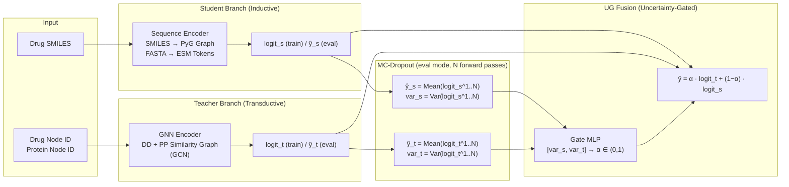
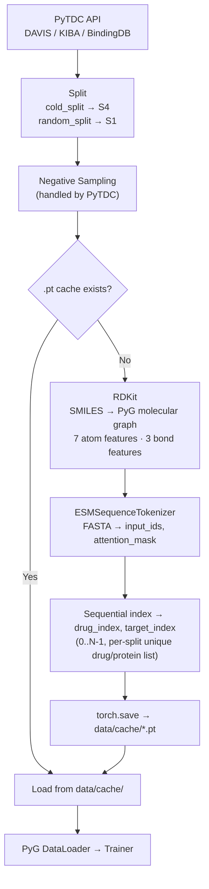
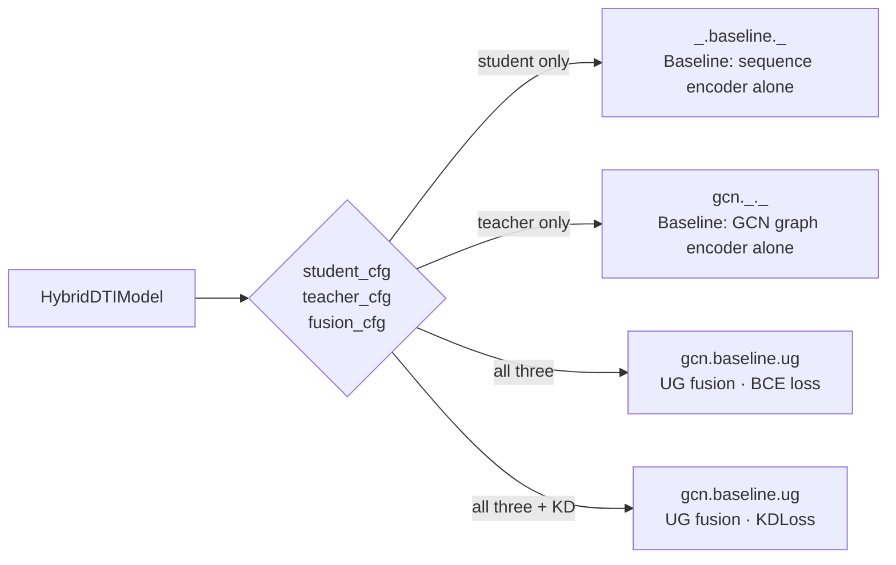

# UGTSDTI: Uncertainty-Gated Teacher–Student Learning for Drug–Target Interaction Prediction

[](https://opensource.org/licenses/MIT)
[](https://www.python.org/downloads/)
[](https://pytorch.org/)

## Abstract

Drug-Target Interaction (DTI) prediction is a critical step in early-stage drug discovery.
A key challenge is the **Cold-Start Problem**: models trained on known drug-protein pairs fail to generalize to entirely
unseen drugs or targets (S2–S4 splits).

UGTSDTI addresses this by combining two complementary encoders via an uncertainty-aware fusion gate (**UG — Uncertainty-Gated**):

- **Teacher** (graph-based, transductive): learns from global Drug-Drug and Protein-Protein similarity graphs. Strong on
  warm-start (S1), degrades on cold-start because new nodes have no graph context.
- **Student** (sequence-based, inductive): encodes directly from SMILES/FASTA. Generalizes to unseen molecules.
- **UG Fusion**: estimates epistemic uncertainty of each branch via MC-Dropout and dynamically weights their
  contributions — when the Teacher is uncertain (cold-start), the Student is trusted more.

The core novelty is this adaptive, uncertainty-driven fusion: most SOTA DTI models commit to one encoder type and do not
handle the warm/cold transition automatically.

---

## The Cold-Start Problem

Standard DTI benchmarks define four evaluation scenarios based on whether drugs and targets appeared during training:

| Scenario | Drug in train | Target in train | Difficulty                        |
|----------|:-------------:|:---------------:|-----------------------------------|
| **S1**   |       ✓       |        ✓        | Easy — warm start                 |
| **S2**   |       ✗       |        ✓        | Medium — cold drug                |
| **S3**   |       ✓       |        ✗        | Medium — cold target              |
| **S4**   |       ✗       |        ✗        | Hard — fully cold, most realistic |

Graph-based (transductive) models excel at S1 but collapse at S4 because new nodes have no embedding in the graph.
Sequence-based (inductive) models generalize better but underperform at S1 where graph context is available. UGTSDTI
aims to handle all four scenarios with a single adaptive model.

---

## Method

### Architecture



### UG Fusion (Uncertainty-Gated)

Epistemic uncertainty is estimated via **Monte Carlo Dropout**: at eval time, the model runs `N` stochastic forward
passes with dropout active and computes both the mean prediction and variance across passes:

```
ŷ_s = Mean({logit_s^(1), ..., logit_s^(N)})   ← prediction logit (eval mode)
var_s = Var({logit_s^(1), ..., logit_s^(N)})   ← epistemic uncertainty

ŷ_t = Mean({logit_t^(1), ..., logit_t^(N)})
var_t = Var({logit_t^(1), ..., logit_t^(N)})
```

Both `ŷ` and `var` come from the **same** `mc_logits` tensor — this is the key correctness property
(Gal & Ghahramani, 2016). During training, a single forward pass is used (dropout active naturally via `model.train()`),
no extra MC passes are run.

The gate MLP maps the uncertainty pair to a scalar weight `α ∈ (0, 1)`:

```
α = σ(MLP([var_s, var_t]))
ŷ = α · ŷ_t + (1 − α) · ŷ_s
```

When the Teacher is uncertain (e.g., cold-start node absent from graph), `var_t` is high → `α → 0` → Student dominates.
When the Teacher is confident (warm-start), `α → 1` → Teacher dominates.

### Training Objective

Training uses **KDLoss**, a convex combination of task loss and knowledge distillation loss:

```
L = (1 − β) · L_task + β · L_distill

where:
  L_task    = BCE(ŷ, y)                  — supervised signal on fused output
  L_distill = MSE(logit_s, logit_t)      — student learns from teacher's logits
  β         = alpha hyperparameter ∈ [0, 1]
```

Note: `β` (KD weight) and `α` (gate weight) are independent — `β` is a fixed training hyperparameter, while `α` is
computed dynamically per sample from uncertainty estimates.

---

## Data Pipeline



Data is fetched automatically via [PyTDC](https://tdcommons.ai/) and cached to `data/cache/` as `.pt` files after the
first run. Subsequent runs load directly from cache.

---

## Installation

```bash
git clone <repo>
cd UGTSDTI
conda env create -f conda-recipes/full.yaml
conda activate ugtsdti
pip install -e .
```

**Stack:** Python 3.10 · PyTorch 2.1+ · PyTorch Geometric · Hydra-core · WandB · PyTDC · RDKit · HuggingFace
Transformers · Loguru

---

## Usage

Configuration is managed via [Hydra](https://hydra.cc/). All parameters can be overridden at the command line.

```bash
# Student-only baseline on S1
conda run -n ugtsdti python -m ugtsdti.main model=_.baseline._ data=tdc_davis_s1

# Teacher-only baseline (GCN) on S2
conda run -n ugtsdti python -m ugtsdti.main model=gcn._._ data=tdc_davis_s2

# Hybrid: GCN teacher + baseline student + UG fusion (BCE loss) on S4
conda run -n ugtsdti python -m ugtsdti.main model=gcn.baseline.ug data=tdc_davis_s4

# Hybrid with Knowledge Distillation loss
conda run -n ugtsdti python -m ugtsdti.main model=gcn.baseline.ug data=tdc_davis_s4 \
    trainer.loss.name=kd trainer.loss.alpha=0.5

# Smoke test all combos (2 epochs, WandB disabled)
WANDB_MODE=disabled bash scripts/smoke.sh
```

## Benchmark Protocols

The repo now exposes explicit Hydra data configs for each evaluation scenario:

| Scenario | Meaning | Hydra config |
|----------|---------|--------------|
| **S1** | warm-start / random split | `data=tdc_davis_s1` |
| **S2** | cold drug | `data=tdc_davis_s2` |
| **S3** | cold target | `data=tdc_davis_s3` |
| **S4** | fully cold (PyTDC `cold_split` without column override) | `data=tdc_davis_s4` |

Example:

```bash
conda run -n ugtsdti python -m ugtsdti.main \
    model=gcn.baseline.ug \
    data=tdc_davis_s3 \
    trainer.loss.name=kd
```

---

## Datasets

| Dataset   | Affinity type        | Binarization threshold | Splits |
|-----------|----------------------|------------------------|--------|
| DAVIS     | Kd (nM)              | pKd ≥ 7.0              | S1, S4 |
| KIBA      | Composite KIBA score | —                      | S1, S4 |
| BindingDB | Kd (nM)              | pKd ≥ 7.0              | S1     |

---

## Evaluation Metrics

| Metric | Type           | Description                                             |
|--------|----------------|---------------------------------------------------------|
| AUROC  | Classification | Area under ROC curve                                    |
| AUPRC  | Classification | Area under Precision-Recall curve                       |
| F1     | Classification | Binary F1 at threshold                                  |
| MSE    | Regression     | Mean squared error on raw affinity values               |
| CI     | Ranking        | Concordance Index — fraction of correctly ordered pairs |

---

## Ablation Modes

The framework natively supports four ablation configurations via `HybridDTIModel`:



---

## Project Structure

```
UGTSDTI/
├── configs/
│   ├── default.yaml                  # Top-level Hydra defaults
│   ├── model/
│   │   ├── _.baseline._.yaml         # only_student
│   │   ├── baseline._._.yaml         # only_teacher (dummy)
│   │   ├── gcn._._.yaml              # only_teacher_gcn
│   │   ├── _.esm._.yaml              # only_esm_student
│   │   ├── baseline.baseline.ug.yaml # hybrid baseline + UG
│   │   └── gcn.baseline.ug.yaml      # hybrid GCN + UG  ← main
│   ├── data/
│   │   └── tdc_davis.yaml
│   └── trainer/
│       └── default_trainer.yaml
├── ugtsdti/
│   ├── main.py                       # Entry point (@hydra.main)
│   ├── core/                         # FROZEN: Registry, Trainer, Metrics
│   ├── data/
│   │   ├── datasets/
│   │   │   └── tdc_dataset.py        # TDCCachingDataset (PyTDC + disk cache)
│   │   └── transforms/
│   │       ├── chemistry.py          # smiles_to_graph (RDKit, OGB-standard features)
│   │       └── sequence.py           # ESMSequenceTokenizer
│   ├── models/
│   │   ├── hybrid.py                 # HybridDTIModel — orchestration + MC-Dropout
│   │   ├── student/
│   │   │   └── baseline.py           # BaselineStudent (GlobalMeanPool)
│   │   ├── teacher/
│   │   │   ├── baseline.py           # BaselineTeacher (nn.Embedding placeholder)
│   │   │   └── gcn_teacher.py        # GCNTeacher (real GCN on DD/PP graphs)
│   │   └── fusion/
│   │       └── ug.py                 # UncertaintyGatedFusion (gate MLP + MC-Dropout)
│   ├── losses/
│   │   ├── bce.py                    # BCELoss (registry: "bce")
│   │   └── kd.py                     # KDLoss (registry: "kd")
│   └── utils/                        # Logger, Seed
├── examples/                         # Per-combo train.py scripts
├── scripts/                          # Shell scripts (local + smoke test)
├── tests/                            # pytest suite (155 tests)
└── .agent/                           # AI context, task tracking, research notes
```

---

## Documentation

Full API reference and narrative guides are built with Sphinx.

```bash
# Install deps (once)
pip install -r docs/requirements.txt

# Live-reload server
cd docs
sphinx-autobuild --watch ../ugtsdti --open-browser source build

# One-shot HTML build
make html
```

Or via Docker:

```bash
docker build --file docs/Dockerfile --tag ugtsdti-docs .
docker run -it --rm -p 8000:8000 ugtsdti-docs
```

---

## Citation

```bibtex
@misc{ugtsdti2026,
    title = {UGTSDTI: Uncertainty-Gated Teacher--Student Learning for
 Drug--Target Interaction Prediction},
    author = {Mysorf},
    year = {2026},
    note = {Work in progress}
}
```

## License

[MIT License](LICENSE)
