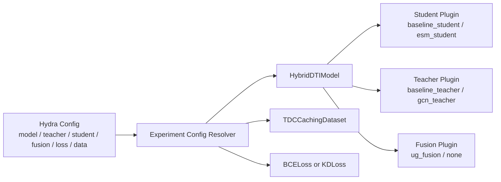
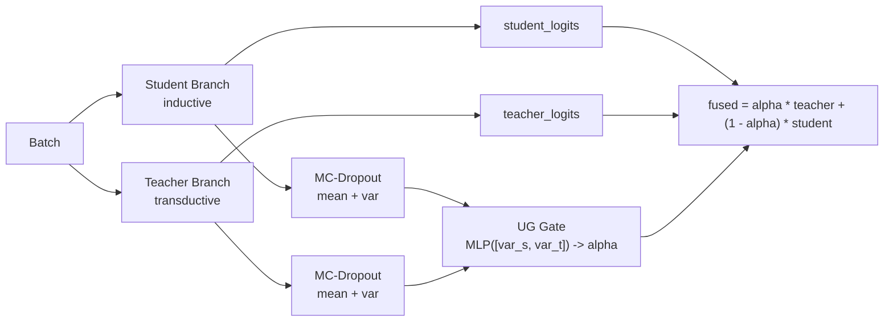
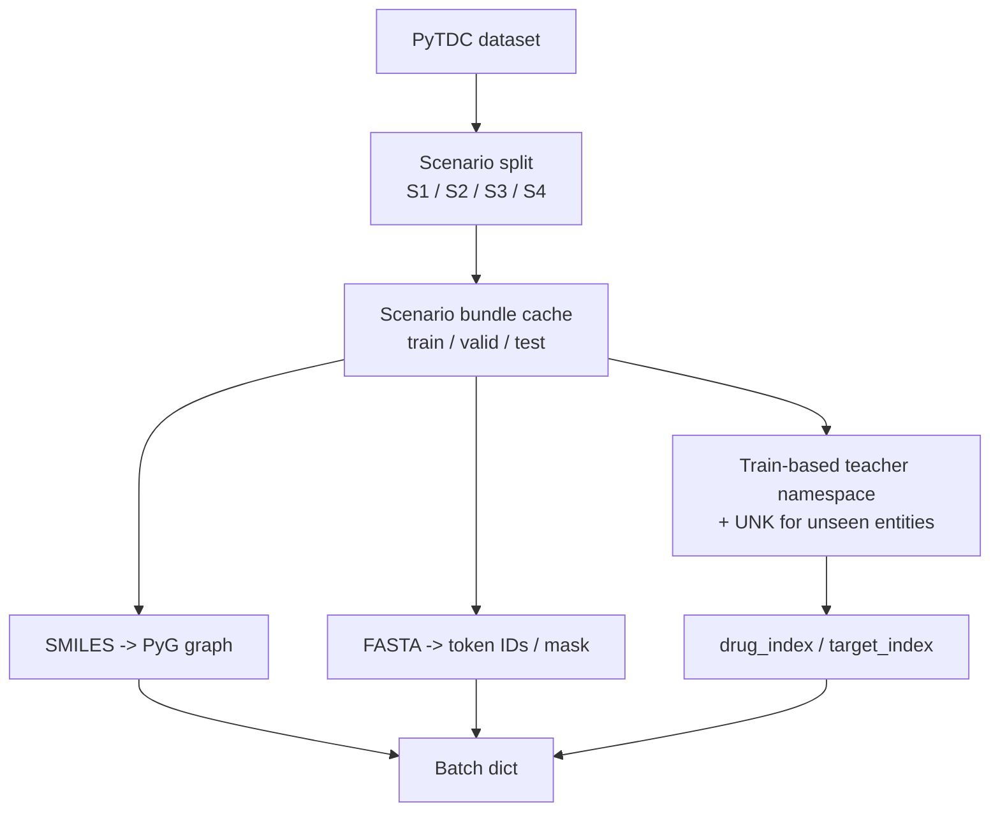

# UGTSDTI: Uncertainty-Gated Teacher-Student Learning for Drug-Target Interaction Prediction

[](https://opensource.org/licenses/MIT)
[](https://www.python.org/downloads/)
[](https://pytorch.org/)

## Overview

UGTSDTI studies a simple research question:

- can a transductive **teacher** dominate on warm-start cases,
- while an inductive **student** remains reliable on cold-start cases,
- and can an **uncertainty-gated fusion** learn when to trust each branch?

The repo implements that idea as a configurable research framework for binary DTI prediction.

## Research Direction

The current codebase is aligned with three core ideas:

1. **Teacher-Student architecture**
   - Teacher: transductive model over shared train-based entity IDs and optional similarity graphs.
   - Student: lighter inductive model operating from raw molecular inputs.
2. **Knowledge Distillation**
   - `loss=kd` distills teacher logits into the student branch.
   - `loss=bce` remains available for ablation.
3. **Uncertainty-Gated fusion**
   - student and teacher uncertainty are estimated with MC-Dropout,
   - a gate predicts `alpha`,
   - fused logit is `alpha * teacher + (1 - alpha) * student`.

## Cold-Start Scenarios

| Scenario | Drug seen in train | Target seen in train | Meaning |
|----------|:------------------:|:--------------------:|---------|
| `S1` | yes | yes | warm-start / random split |
| `S2` | no | yes | cold drug |
| `S3` | yes | no | cold target |
| `S4` | no | no | fully cold |

These are exposed explicitly as Hydra data configs:

- `data=tdc_davis_s1`
- `data=tdc_davis_s2`
- `data=tdc_davis_s3`
- `data=tdc_davis_s4`

## System Design

The framework is now slot-based and plugin-oriented.



The top-level entrypoints are intentionally thin:

- `python -m ugtsdti.main`
- `python -m ugtsdti.benchmark`

The real orchestration now lives in:

- `ugtsdti.experiment.config`
- `ugtsdti.experiment.runtime`
- `ugtsdti.experiment.benchmarking`

## Model Architecture



Important implementation details in the current code:

- train and eval can use different MC budgets via `train_mc_samples` and `eval_mc_samples`
- all model modes return a standardized output schema:
  - `logits`
  - `student_logits`
  - `teacher_logits`
  - `gate_alpha`
  - `student_var`
  - `teacher_var`
- branch-wise metrics and research diagnostics are logged during evaluation

## Data Pipeline



Current behavior:

- data is split first, then cached per scenario bundle
- teacher entity vocab is built from the **train split only**
- validation/test entities unseen in train map to explicit `UNK` indices
- protocol audit/probe utilities live under `ugtsdti.data.protocols`

## Configuration

Preferred CLI style:

```bash
# Student-only baseline on S1
conda run -n ugtsdti python -m ugtsdti.main \
  model=hybrid teacher=none student=baseline fusion=none \
  data=tdc_davis_s1 loss=bce

# Teacher-only GCN on S2
conda run -n ugtsdti python -m ugtsdti.main \
  model=hybrid teacher=gcn student=none fusion=none \
  data=tdc_davis_s2 loss=bce

# Hybrid + UG + KD on S4
conda run -n ugtsdti python -m ugtsdti.main \
  model=hybrid teacher=gcn student=baseline fusion=ug \
  data=tdc_davis_s4 loss=kd loss.params.alpha=0.5
```

Key config groups:

- `configs/model/hybrid.yaml`
- `configs/teacher/*.yaml`
- `configs/student/*.yaml`
- `configs/fusion/*.yaml`
- `configs/loss/*.yaml`
- `configs/data/*.yaml`
- `configs/benchmark/default.yaml`

## Benchmarking

Benchmark config uses explicit experiment specs instead of encoded model aliases:

```yaml
experiments:
  - name: hybrid_gcn_baseline_ug
    model: hybrid
    teacher: gcn
    student: baseline
    fusion: ug
```

The benchmark runner writes:

- `summary/`
- `aggregate/`
- `report/`
- `report_aggregate/`
- `protocol/`
- `manifest.json`

## Evaluation and Research Logging

Besides standard metrics such as AUROC, AUPRC, and F1, the current runtime logs:

- `gate_alpha_*`
- `student_var_*`
- `teacher_var_*`
- `student_*` branch metrics
- `teacher_*` branch metrics
- `unk_drug_rate`
- `unk_target_rate`
- split audit metrics for validation and test

This makes the repo usable not only for training, but for analyzing whether the uncertainty gate behaves as intended across `S1-S4`.

## Installation

```bash
git clone <repo>
cd UGTSDTI
conda env create -f conda-recipes/full.yaml
conda activate ugtsdti
pip install -e .
```

**Stack:** Python 3.10 · PyTorch 2.1+ · PyTorch Geometric · Hydra-core · WandB · PyTDC · RDKit · HuggingFace
Transformers · Loguru

## Quick Start

Configuration is managed via [Hydra](https://hydra.cc/). All parameters can be overridden at the command line.

```bash
# Main experiment
conda run -n ugtsdti python -m ugtsdti.main \
  model=hybrid teacher=gcn student=baseline fusion=ug \
  data=tdc_davis_s4 loss=kd

# Benchmark matrix
conda run -n ugtsdti python -m ugtsdti.benchmark

# Canonical smoke scripts
WANDB_MODE=disabled bash scripts/smoke.sh
```

## Project Structure

```text
UGTSDTI/
├── configs/
│   ├── model/
│   ├── teacher/
│   ├── student/
│   ├── fusion/
│   ├── loss/
│   ├── data/
│   ├── trainer/
│   └── benchmark/
├── ugtsdti/
│   ├── experiment/        # config/runtime/benchmark orchestration
│   ├── data/
│   │   ├── datasets/
│   │   ├── transforms/
│   │   ├── protocols/
│   │   └── graph_builder.py
│   ├── models/
│   ├── losses/
│   ├── core/
│   ├── main.py
│   └── benchmark.py
├── scripts/
├── tests/
│   ├── research/
│   └── quality/
└── docs/
```

---

## Documentation

Full API reference and narrative guides are built with Sphinx.

```bash
# Install deps (once)
pip install -r docs/requirements.txt

# Live-reload server
cd docs
sphinx-autobuild --watch ../ugtsdti --open-browser source build

# One-shot HTML build
make html
```

Or via Docker:

```bash
docker build --file docs/Dockerfile --tag ugtsdti-docs .
docker run -it --rm -p 8000:8000 ugtsdti-docs
```

---

## Citation

```bibtex
@misc{ugtsdti2026,
    title = {UGTSDTI: Uncertainty-Gated Teacher--Student Learning for
 Drug--Target Interaction Prediction},
    author = {Mysorf},
    year = {2026},
    note = {Work in progress}
}
```

## License

[MIT License](LICENSE)
